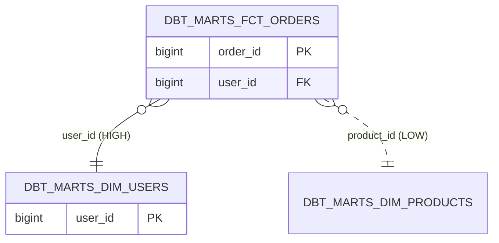

# redshift-erd

[English](README.md) · **日本語** · [繁體中文](README.zh-TW.md)

`redshift-erd` は **redshift-comment-mcp** プラグインに含まれる読み取り
専用スキルで、Redshift スキーマの Mermaid `erDiagram` をテーブル、主要
カラム、推論された外部キーとともに生成します。FK は 3 階層で推論され、
各エッジに信頼度ラベルが付くため、読み手が推測を契約と誤解しません。

**Redshift FK の現実**。Redshift は外部キーを *宣言* できますが、
オプティマイザは **強制しません** — 孤立行は実際に発生します。
`pg_constraint` の FK はあくまでヒントであり保証ではありません。
そこで本スキルは各エッジに `HIGH`（宣言済み）、`MEDIUM`（dbt
`depends_on`）、`LOW`（命名ヒューリスティック `<other>_id`）の
ラベルを付け、フッターで「信頼する前に検証してください」と明示します。

## 使うべき場面

- 未知のウェアハウスを掘り下げる前のマッピング
- データエンジニアのドメイン onboarding
- 設計レビューや RFC 用の図の作成

## 呼び出し例

```
/redshift-erd --schema dbt_marts --manifest target/manifest.json
```

## 出力（抜粋）



詳細なフロー・クエリ・エラー表は [SKILL.md](./SKILL.md) を参照してください。
