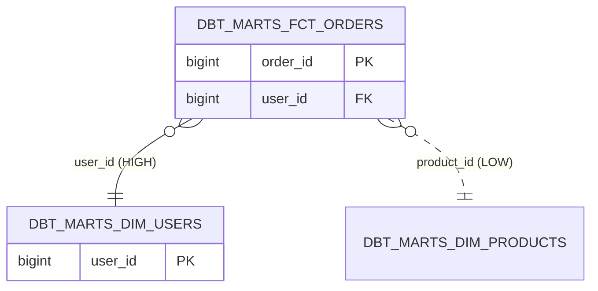

# redshift-erd

**English** · [日本語](README.ja.md) · [繁體中文](README.zh-TW.md)

`redshift-erd` is a read-only skill in the **redshift-comment-mcp** plugin
that renders a Mermaid `erDiagram` for a Redshift schema, including
tables, key columns, and inferred foreign-key edges. FKs are inferred
through three tiers and each edge is labeled with its confidence so
readers do not trust a guess as if it were a contract.

**The Redshift FK reality check.** Redshift lets you *declare* foreign
keys, but the optimizer does **not enforce them** — orphan rows can and
do exist. A declared FK in `pg_constraint` is a hint, not a guarantee.
This skill therefore labels every edge `HIGH` (declared), `MEDIUM` (dbt
`depends_on`), or `LOW` (naming heuristic `<other>_id`) and prints a
footer reminding you to verify before trusting.

## When to use

- Mapping an unfamiliar warehouse before drilling into specific tables
- Onboarding a new data engineer to a domain
- Producing a diagram for a design review or RFC

## Example invocation

```
/redshift-erd --schema dbt_marts --manifest target/manifest.json
```

## Abbreviated output



See [SKILL.md](./SKILL.md) for the full flow, query, and error matrix.
