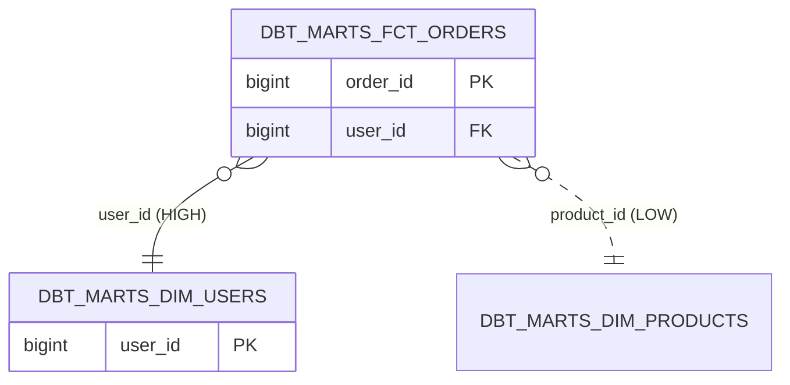

# redshift-erd

[English](README.md) · [日本語](README.ja.md) · **繁體中文**

`redshift-erd` 是 **redshift-comment-mcp** plugin 中的唯讀技能，會為
Redshift schema 產生 Mermaid `erDiagram`，包含資料表、主要欄位以及推論
出的外鍵關係。FK 透過三個層級推論，每條邊都標註信賴度，避免讀者把推測
當成契約。

**Redshift FK 的現實**。Redshift 允許 *宣告* 外鍵，但 optimizer
**不會強制執行** — 孤兒列實際上會出現。`pg_constraint` 中的 FK 只是
提示，不是保證。因此本技能在每條邊標註 `HIGH`（已宣告）、`MEDIUM`
（dbt `depends_on`）或 `LOW`（命名啟發式 `<other>_id`），並在頁尾提醒
使用者「信任前請先驗證」。

## 何時使用

- 在深入查表之前先繪出陌生資料倉儲的全貌
- 新進資料工程師的領域 onboarding
- 為設計審查或 RFC 產出關係圖

## 呼叫範例

```
/redshift-erd --schema dbt_marts --manifest target/manifest.json
```

## 輸出（節錄）



完整流程、查詢與錯誤對照請見 [SKILL.md](./SKILL.md)。
